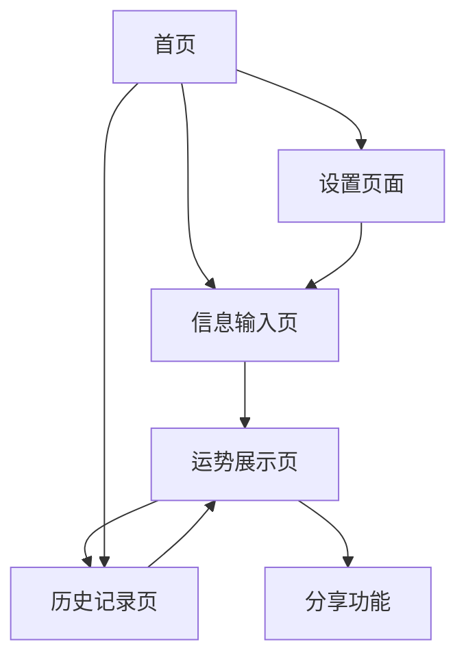

# AI 运势预测应用 - 产品需求文档

## 1. Product Overview
基于 OpenAI API 的智能运势预测应用，为用户提供个性化的运势分析和预测服务。
- 通过用户个人信息结合 AI 技术，生成准确、有趣的运势内容，帮助用户了解未来趋势并做出更好的决策。
- 目标打造一个集娱乐性和实用性于一体的运势预测平台，满足用户对未来的好奇心和指导需求。

## 2. Core Features

### 2.1 User Roles
本应用采用单一用户角色设计，无需复杂的权限管理：

| Role | Registration Method | Core Permissions |
|------|---------------------|------------------|
| 普通用户 | 邮箱注册或第三方登录 | 可输入个人信息、查看运势预测、保存历史记录 |

### 2.2 Feature Module
我们的 AI 运势预测应用包含以下主要页面：
1. **首页**：应用介绍、快速开始按钮、功能导航
2. **信息输入页**：个人信息收集表单、星座选择、生日输入
3. **运势展示页**：运势结果展示、时间维度切换、运势类型选择
4. **历史记录页**：过往预测记录、收藏功能、趋势分析
5. **设置页面**：个人资料管理、通知设置、主题切换

### 2.3 Page Details

| Page Name | Module Name | Feature description |
|-----------|-------------|---------------------|
| 首页 | 欢迎区域 | 展示应用 logo、slogan 和主要功能介绍，引导用户开始使用 |
| 首页 | 功能导航 | 提供快速访问各功能模块的入口，包括运势预测、历史记录等 |
| 信息输入页 | 个人信息表单 | 收集用户姓名、性别、出生日期、出生时间和地点等基础信息 |
| 信息输入页 | 星座识别 | 根据生日自动计算星座，支持手动选择和修正 |
| 信息输入页 | 预测设置 | 选择预测时间范围（今日/本周/本月）和运势类型（综合/爱情/事业/财运/健康） |
| 运势展示页 | AI 运势生成 | 调用 OpenAI API 基于用户信息生成个性化运势内容 |
| 运势展示页 | 多维度展示 | 支持今日、本周、本月三个时间维度的运势切换查看 |
| 运势展示页 | 分类运势 | 提供爱情、事业、财运、健康四个类别的专项运势预测 |
| 运势展示页 | 分享功能 | 支持将运势结果分享到社交媒体或保存为图片 |
| 历史记录页 | 记录列表 | 显示用户历史预测记录，支持按时间和类型筛选 |
| 历史记录页 | 收藏管理 | 用户可收藏喜欢的预测结果，便于后续查看 |
| 设置页面 | 个人资料 | 管理和更新用户基本信息，修改头像和昵称 |
| 设置页面 | 偏好设置 | 设置默认预测类型、通知提醒和界面主题 |

## 3. Core Process

**用户使用流程：**
用户首次进入应用后，在首页了解功能并点击开始使用 → 在信息输入页填写个人信息和选择预测偏好 → 系统调用 OpenAI API 生成个性化运势 → 在运势展示页查看结果并可切换不同时间维度和类型 → 可选择分享或保存到历史记录 → 后续可在历史记录页查看过往预测。

## 4. User Interface Design

### 4.1 Design Style
- **主色调**：深紫色 (#6B46C1) 和金色 (#F59E0B)，营造神秘而温暖的氛围
- **辅助色**：浅紫色 (#E0E7FF) 和米白色 (#FEFBF3) 作为背景色
- **按钮样式**：圆角设计，带有渐变效果和轻微阴影
- **字体**：中文使用思源黑体，英文使用 Inter，主标题 24px，正文 16px
- **布局风格**：卡片式设计，顶部导航，响应式布局
- **图标风格**：线性图标配合星座、水晶球等神秘元素

### 4.2 Page Design Overview

| Page Name | Module Name | UI Elements |
|-----------|-------------|-------------|
| 首页 | 欢迎区域 | 渐变背景，居中大标题，副标题描述，CTA 按钮使用金色渐变 |
| 首页 | 功能导航 | 网格布局的功能卡片，每个卡片包含图标、标题和简短描述 |
| 信息输入页 | 个人信息表单 | 分步骤的表单设计，每个输入框带有浮动标签和验证提示 |
| 信息输入页 | 星座选择 | 12 星座图标网格，支持点击选择，选中状态有高亮效果 |
| 运势展示页 | 运势内容 | 卡片式布局，运势文字采用优雅的排版，配有相关插图 |
| 运势展示页 | 时间切换 | Tab 切换组件，今日/本周/本月三个选项 |
| 运势展示页 | 类型选择 | 水平滚动的标签组件，支持多选 |
| 历史记录页 | 记录列表 | 时间线样式的列表，每条记录显示日期、类型和预测摘要 |
| 设置页面 | 设置项 | 列表式布局，每个设置项包含图标、标题和开关/选择器 |

### 4.3 Responsiveness
应用采用移动端优先的响应式设计，支持手机、平板和桌面端访问。针对触屏设备优化交互体验，按钮和可点击区域不小于 44px，支持手势操作。