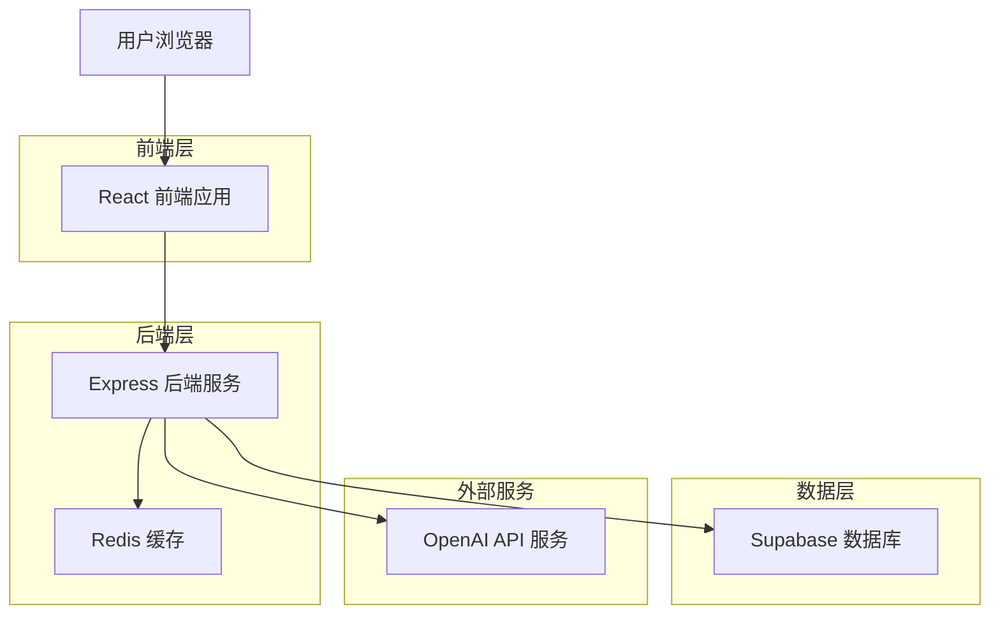
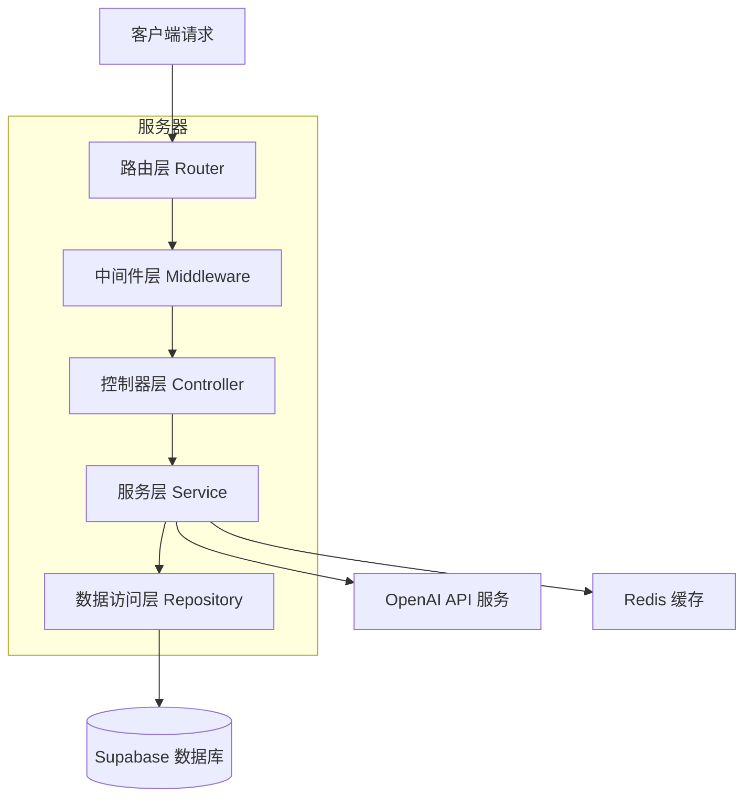
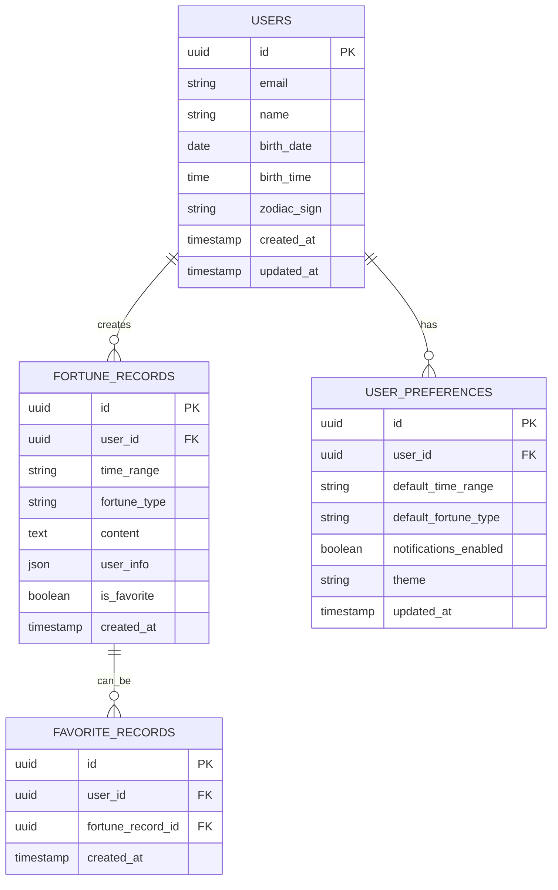

# AI 运势预测应用 - 技术架构文档

## 1. Architecture design



## 2. Technology Description

- Frontend: React@18 + TypeScript + Tailwind CSS@3 + Vite
- Backend: Express@4 + TypeScript + Node.js
- Database: Supabase (PostgreSQL)
- Cache: Redis
- External API: OpenAI GPT-4 API
- Authentication: Supabase Auth

## 3. Route definitions

| Route | Purpose |
|-------|----------|
| / | 首页，展示应用介绍和主要功能入口 |
| /input | 信息输入页，收集用户个人信息和预测偏好 |
| /fortune | 运势展示页，显示 AI 生成的运势预测结果 |
| /history | 历史记录页，查看用户过往的预测记录 |
| /settings | 设置页面，管理个人资料和应用偏好 |
| /login | 登录页面，用户身份验证 |
| /register | 注册页面，新用户账户创建 |

## 4. API definitions

### 4.1 Core API

用户认证相关
```
POST /api/auth/register
```

Request:
| Param Name | Param Type | isRequired | Description |
|------------|------------|------------|-------------|
| email | string | true | 用户邮箱地址 |
| password | string | true | 用户密码 |
| name | string | true | 用户姓名 |

Response:
| Param Name | Param Type | Description |
|------------|------------|-------------|
| success | boolean | 注册是否成功 |
| user | object | 用户信息对象 |
| token | string | JWT 认证令牌 |

```
POST /api/auth/login
```

Request:
| Param Name | Param Type | isRequired | Description |
|------------|------------|------------|-------------|
| email | string | true | 用户邮箱地址 |
| password | string | true | 用户密码 |

Response:
| Param Name | Param Type | Description |
|------------|------------|-------------|
| success | boolean | 登录是否成功 |
| user | object | 用户信息对象 |
| token | string | JWT 认证令牌 |

运势预测相关
```
POST /api/fortune/predict
```

Request:
| Param Name | Param Type | isRequired | Description |
|------------|------------|------------|-------------|
| userInfo | object | true | 用户个人信息（姓名、生日、星座等） |
| timeRange | string | true | 预测时间范围（daily/weekly/monthly） |
| fortuneType | string | true | 运势类型（general/love/career/wealth/health） |

Response:
| Param Name | Param Type | Description |
|------------|------------|-------------|
| success | boolean | 预测是否成功 |
| fortune | object | 运势预测结果对象 |
| id | string | 预测记录 ID |

```
GET /api/fortune/history
```

Request:
| Param Name | Param Type | isRequired | Description |
|------------|------------|------------|-------------|
| page | number | false | 页码，默认为 1 |
| limit | number | false | 每页数量，默认为 10 |
| type | string | false | 筛选运势类型 |

Response:
| Param Name | Param Type | Description |
|------------|------------|-------------|
| success | boolean | 请求是否成功 |
| data | array | 历史记录数组 |
| total | number | 总记录数 |
| page | number | 当前页码 |

用户资料相关
```
PUT /api/user/profile
```

Request:
| Param Name | Param Type | isRequired | Description |
|------------|------------|------------|-------------|
| name | string | false | 用户姓名 |
| birthDate | string | false | 出生日期 |
| birthTime | string | false | 出生时间 |
| zodiacSign | string | false | 星座 |

Response:
| Param Name | Param Type | Description |
|------------|------------|-------------|
| success | boolean | 更新是否成功 |
| user | object | 更新后的用户信息 |

## 5. Server architecture diagram



## 6. Data model

### 6.1 Data model definition



### 6.2 Data Definition Language

用户表 (users)
```sql
-- 创建用户表
CREATE TABLE users (
    id UUID PRIMARY KEY DEFAULT gen_random_uuid(),
    email VARCHAR(255) UNIQUE NOT NULL,
    name VARCHAR(100) NOT NULL,
    birth_date DATE,
    birth_time TIME,
    zodiac_sign VARCHAR(20),
    created_at TIMESTAMP WITH TIME ZONE DEFAULT NOW(),
    updated_at TIMESTAMP WITH TIME ZONE DEFAULT NOW()
);

-- 创建索引
CREATE INDEX idx_users_email ON users(email);
CREATE INDEX idx_users_zodiac ON users(zodiac_sign);
```

运势记录表 (fortune_records)
```sql
-- 创建运势记录表
CREATE TABLE fortune_records (
    id UUID PRIMARY KEY DEFAULT gen_random_uuid(),
    user_id UUID NOT NULL,
    time_range VARCHAR(20) NOT NULL CHECK (time_range IN ('daily', 'weekly', 'monthly')),
    fortune_type VARCHAR(20) NOT NULL CHECK (fortune_type IN ('general', 'love', 'career', 'wealth', 'health')),
    content TEXT NOT NULL,
    user_info JSONB,
    is_favorite BOOLEAN DEFAULT FALSE,
    created_at TIMESTAMP WITH TIME ZONE DEFAULT NOW()
);

-- 创建索引
CREATE INDEX idx_fortune_records_user_id ON fortune_records(user_id);
CREATE INDEX idx_fortune_records_created_at ON fortune_records(created_at DESC);
CREATE INDEX idx_fortune_records_type ON fortune_records(fortune_type);
CREATE INDEX idx_fortune_records_favorite ON fortune_records(is_favorite) WHERE is_favorite = TRUE;
```

用户偏好表 (user_preferences)
```sql
-- 创建用户偏好表
CREATE TABLE user_preferences (
    id UUID PRIMARY KEY DEFAULT gen_random_uuid(),
    user_id UUID UNIQUE NOT NULL,
    default_time_range VARCHAR(20) DEFAULT 'daily',
    default_fortune_type VARCHAR(20) DEFAULT 'general',
    notifications_enabled BOOLEAN DEFAULT TRUE,
    theme VARCHAR(20) DEFAULT 'light',
    updated_at TIMESTAMP WITH TIME ZONE DEFAULT NOW()
);

-- 创建索引
CREATE INDEX idx_user_preferences_user_id ON user_preferences(user_id);
```

收藏记录表 (favorite_records)
```sql
-- 创建收藏记录表
CREATE TABLE favorite_records (
    id UUID PRIMARY KEY DEFAULT gen_random_uuid(),
    user_id UUID NOT NULL,
    fortune_record_id UUID NOT NULL,
    created_at TIMESTAMP WITH TIME ZONE DEFAULT NOW(),
    UNIQUE(user_id, fortune_record_id)
);

-- 创建索引
CREATE INDEX idx_favorite_records_user_id ON favorite_records(user_id);
CREATE INDEX idx_favorite_records_fortune_id ON favorite_records(fortune_record_id);
```

-- 设置 Supabase 权限
```sql
-- 为匿名用户授予基本读取权限
GRANT SELECT ON users TO anon;
GRANT SELECT ON fortune_records TO anon;

-- 为认证用户授予完整权限
GRANT ALL PRIVILEGES ON users TO authenticated;
GRANT ALL PRIVILEGES ON fortune_records TO authenticated;
GRANT ALL PRIVILEGES ON user_preferences TO authenticated;
GRANT ALL PRIVILEGES ON favorite_records TO authenticated;
```